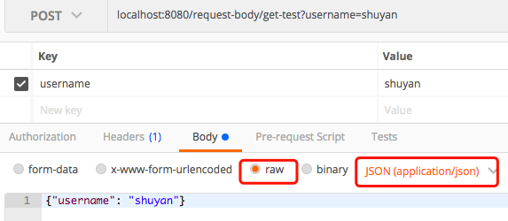

# springMVC注解

> + springMVC的所有注解，可以在`spring-web-5.0.6.RELEASE.jar`和`spring-webmvc-5.0.6.RELEASE.jar`两个jar包中直接`find in path`搜索`@interface`找到
>
>   > 注意，两个jar包需要先下载源码
>
> + 学习资料
>

## spring-web

### @RequestHeader

+ 作用：用于获取指定的请求头

+ 例

  ```java
  public void queryUser(@RequestHeader("Accept-Encoding") String encoding,  @RequestHeader("Keep-Alive") long keepAlive)  {  
  }  
  ```

### @ResponseStatus

+ 作用：用于手动响应指定状态码的错误

  >  当需要手动响应1个指定状态码的错误时，可以先使用本注解指定响应状态码定义1个异常类，然后手动抛出该异常

+ 作用在类上

  例

  + 异常类

    ```java
    @ResponseStatus(HttpStatus.BAD_GATEWAY)
    public class HttpStatusBadGetWayException extends RuntimeException{
        private static final long serialVersionUID = 1L;
        public HttpStatusBadGetWayException(String message) {
            super(message);
        }
    }
    ```

  + 调用者

    ```java
    @RestController
    public class ResponseStatusController {
        @GetMapping("/test")
        public void test(){
            throw new HttpStatusBadGetWayException("响应执行状态码的错误");
        }
    }
    ```

  + 返回结果

    ```json
    {
        "timestamp": "2018-08-20T05:26:05.349+0000",
        "status": 502,
        "error": "Bad Gateway",
        "message": "响应执行状态码的错误",
        "path": "/test"
    }
    ```

  + 分析

    > 当抛出该异常时，因为该异常上标注了本注解，所以spring直接响应了1个该注解指定的状态码的错误

+ 作用在方法上

  > 该注解不可以用在标注了`@xxxMapping`的方法，否则程序正常执行时也会返回异常
  >
  > 该注解可以与`@ExceptionHandler`注解共同标注在方法上，当执行这个方法时就会返回指定的状态码

  例

  ```java
  @ResponseStatus(HttpStatus.INTERNAL_SERVER_ERROR)
  @ExceptionHandler(Exception.class)
  public ResponseEntity handleException(Exception e) {
      logger.error("系统错误: ", e);
      ErrorResponse errorResponse = new ErrorResponse(1005, "系统繁忙");
      return new ResponseEntity<Object>(errorResponse, HttpStatus.INTERNAL_SERVER_ERROR);
  }
  ```

  > 当产生`Exception`时，就会返回500错误

### @ExceptionHandler

+ 作用：声名某方法为某种异常的处理函数

  > 当产生的异常与声名的异常匹配上时，会调用本注解标注的方法

+ 参数

  + value：要匹配的异常，可以是多个；如：`{Exception.class,Exception.class}`

+ 例

  + controller

    ```java
    @RestController
    @RequestMapping("exception_handler")
    public class ExceptionHandlerController {
        @GetMapping("/test")
        public Integer test(){
            return 100/0;
        }
        @ExceptionHandler({Exception.class})
        public Map<String,String> exceptionHandler(final Exception ex, final WebRequest req){
            Map<String,String> map = new HashMap<>();
            map.put("status","500");
            map.put("message", ex.getMessage());
            return map;
        }
    }
    ```

  + 返回结果

    ```json
    {
        "message": "/ by zero",
        "status": "500"
    }
    ```

+ 说明

  + 产生异常时，如有多个`ExceptionHandler`可以匹配这个异常，则优先选择最接近这个异常的`ExceptionHandler`
  + 默认`ExceptionHandler`只在其所在的`Controller`中有效，如果需要将该`ExceptionHandler`应用到所有的Controller上，需要配合`@ControllerAdvice`注解一起使用

+ `@ExceptionHandler`与`@ControllerAdvice`

  + 将`@ExceptionHandler`应用到`@ControllerAdvice`标注的类上，则该类中的`@ExceptionHandler`会被应用到所有`Controller`的`@RequestMapping`方法上

  + 例

    + ControllerAdvice

      ```java
      @ControllerAdvice
      @ResponseBody
      public class MyControllerAdvice {
          @ExceptionHandler({Exception.class})
          public Map<String,String> exceptionHandler(final Exception ex, final WebRequest req){
              Map<String,String> map = new HashMap<>();
              map.put("status","500");
              map.put("message", ex.getMessage());
              return map;
          }
      }
      ```

    + Controller

      ```java
      @RestController
      @RequestMapping("/exception_handler")
      public class AdviceController {
          @GetMapping("/advice")
          public Integer test(){
              return 100/0;
          }
      }
      ```

    + 返回结果

      ```json
      {
          "message": "/ by zero",
          "status": "500"
      }
      ```

### @ControllerAdvice

+ 作用：

  >  用于定义1个bean，该bean中可以拥有@ExceptionHandler, @InitBinder或 @ModelAttribute注解的方法，并且这些方法会被应用到控制器类层次的所有@RequestMapping方法上。

+ 例

  参见[@ExceptionHandler](#@ExceptionHandler)中的第2个例程

### @RestControllerAdvice

> 相当于`@ResponseBody`+`@RestControllerAdvice`

### @InitBinder

+ 作用

  > 请求参数都是字符串，但是接收参数时可能使用各种类型进行接收；当请求参数无法自动转换为接收参数的类型时，可以使用该注解进行类型转换；如：2018-01-01无法自动转换为Date类型

+ 基本用法

  > 本注解的基本用法就是在`controller`内部使用springmvc提供的几种类型转换器进行类型转换

  + 例

    ```java
    @RestController
    @RequestMapping("/init-binder")
    public class InitBinderController {
        @InitBinder
        protected void initBinder(WebDataBinder binder) {
            SimpleDateFormat dateFormat = new SimpleDateFormat("yyyy-MM-dd");
            dateFormat.setLenient(false);
            binder.registerCustomEditor(Date.class, new CustomDateEditor(dateFormat, false));
        }
    
        @GetMapping("/test")
        public void test(Date birthday){
            System.out.println(birthday);
        }
    }
    ```

    > spring在将请求参数映射到参数列表中接收的属性上之前，会先将接受参数类型与转换器中参数类型匹配上的参数使用转换器进行转换

+ 自定义类型转换器

  > 当spring内置的类型转换器不够用时，可以自定义类型转换器

  + 自定义方法

    > + 写1个继承`PropertiesEditor`的类
    > + 重写`setAsText`或`setAsValue`方法，在该方法中进行类型转换，传入参数为请求参数
    > + 将转换结果使用`setValue`方法返回

  + 例

    + 自定义转换器

      ```java
      public class MyCustomerEditor extends PropertiesEditor {
          /**
           * 说明：重写 setAsText 或 setAsValue 方法
           * @param text 前台传过来的字符串
           * @throws IllegalArgumentException
           */
          @Override
          public void setAsText(String text) throws IllegalArgumentException {
              SimpleDateFormat sdf=getDate(text);
              try {
                  // 使用该方法将转换后的结果返回
                  setValue(sdf.parseObject(text));
              } catch (ParseException e) {
                  e.printStackTrace();
              }
          }
          private SimpleDateFormat getDate(String source) {
              SimpleDateFormat sdf;
              if (Pattern.matches("^\\d{4}-\\d{2}-\\d{2}$", source)) {
                  sdf=new SimpleDateFormat("yyyy-MM-dd");
              }else if (Pattern.matches("^\\d{4}/\\d{2}/\\d{2}$", source)) {
                  sdf=new SimpleDateFormat("yyyy/MM/dd");
              }else if (Pattern.matches("^\\d{4}\\d{2}\\d{2}$", source)) {
                  sdf=new SimpleDateFormat("yyyyMMdd");
              }else {
                  throw new TypeMismatchException("", Date.class);
              }
              return sdf;
          }
      }
      ```

    + 使用自定义转换器

      ```java
      @RestController
      @RequestMapping("/init-binder")
      public class InitBinderController2 {
          @InitBinder
          protected void initBinder(WebDataBinder binder) {
              // 注册自定义的转换器
              binder.registerCustomEditor(Date.class, new MyCustomerEditor());
          }
      
          @GetMapping("/test1")
          public void test(Date birthday){
              System.out.println(birthday);
          }
      }
      ```

+ 全局使用`@InitBinder`

  > 上述方式的`@InitBinder`只能在当前`controller`中使用
  >
  > 如果想全局使用，需要结合[@ControllerAdvice](#@ControllerAdvice)注解

### @ModelAttribute

> 先不学

### @RequestAttribute

- 作用：用于获取在拦截器或过滤器中设置到request域中的属性

- 例

  ```java
  @RequestMapping(value="/data/custom", method=RequestMethod.GET)
  public @ResponseBody String custom(@RequestAttribute("foo") String foo) {
      return "Got 'foo' request attribute value '" + foo + "'";
  }
  ```

### @SessionAttributes

- 作用：本注解只能标注到controller类上，该controller中的每个方法执行前，都会自动将session对象中指定的几个属性设置到model对象中，方法执行后再将model对象中对应的属性值存回session对象中

- 例：

  ```java
  @RestController
  @RequestMapping("/session-attribute")
  @SessionAttributes({"name"})
  public class SessionAttributesController {
      @ModelAttribute("name")
      public String modelInit(String name){
          System.out.println("model = "+ name);
          return name;
      }
      @RequestMapping("/test1")
      public void test(@ModelAttribute("name") String name){
          System.out.println(name);
      }
  }
  ```

  > + 先访问`localhost:8080/session-attribute/test1?name=123`
  >
  >   打印：
  >
  >   	model = 123
  >	
  >   	123
  >
  > + 先访问`localhost:8080/session-attribute/test1`
  >
  >   打印：
  >
  >   	123

### @SessionAttribute

> 先不学

### @RestController

> 该注解等同于`@ResponseBody`+`@Controller`

### @Mapping

> 各种`@xxxMapping`注解都是基于这个注解的，没有查到该注解相关资料，应该是用于url映射的元注解，这里不深入研究

### @RequestMapping

+ 功能

  > 用于url映射，任意请求方法类型都可以受理
  >
  > 可以标注到Controller类上或Controller类中的方法上

+ 属性

  + value

    + 类型：String[]
    + 作用：用于将指定请求的实际地址映射到方法上

  + name

    - 类型：String
    - 作用：给映射地址指定一个别名

  + method

    - 类型：RequestMethod[]

    - 作用：

      > 映射指定请求的方法类型，包括GET、POST、HEAD、OPTIONS、PUT、PATCH、DELETE、TRACE

  + consumes

    - 类型：String[]
    - 作用：指定处理请求的提交内容类型(Content-Type),例如application/json、text/html等

  + produces

    - 类型：String[]
    - 作用：指定返回的内容类型，返回的内容类型必须是request请求头(Accept)中所包含的类型

  + params

    - 类型：String[]
    - 作用：指定request中必须包含某些参数值时，才让该方法处理

  + headers

    - 类型：String[]
    - 作用：指定request中必须包含某些指定的header值，才能让该方法处理请求

  + Path

    + 类型：String[]

    + 作用：

      > 在Servlet环境中只有:uri路径映射(例如："/myPath.do")。在方法层面上，支持相对路径(例如:"edit.do")

### @GetMapping

> @RequestMapping(method = RequestMethod.GET)的缩写

### @PostMapping

> @RequestMapping(method = RequestMethod.POST)的缩写

### @PutMapping

> @RequestMapping(method = RequestMethod.PUT)的缩写

### @DeleteMapping

> @RequestMapping(method = RequestMethod.DELETE)的缩写

### @PatchMapping

> @RequestMapping(method = RequestMethod.PATCH)的缩写

### @RequestParam

+ 作用：用于将请求参数映射到其标注的参数上

+ 要求

  + 请求头不是`application/json`的时候

+ 属性

  + value

    + 类型：String

    + 作用：用于指定请求参数名

      如果请求参数名与属性名相同时，可以省略该注解

  + name

    > 与value属性一模一样

  + required

    + 类型：boolean
    + 作用：指定该参数是否必传

  + defaultValue

    + 类型：String
    + 作用：指定默认值

### @RequestBody

+ 作用：用于将请求体中的json解析为实体类

+ 要求

  > 使用该注解时，需要满足以下要求
  >
  > + json必须放在请求正文中，不可以拼接到url
  >
  >   因为GET请求没有正文，所以不适用于GET请求
  >
  > + `Content-Type`请求头必须为`application/json`

  因为上述第2点要求，所以使用POSTMAN测试时需要按如下方式发送请求：

   

+ 例

  + controller

    ```java
    @RestController
    @RequestMapping("/request-body")
    public class RequestBodyController {
        @RequestMapping("/get-test")
        public User getTest(String username,@RequestBody User user){
            System.out.println(username);
            return user;
        }
    }
    ```

  + 请求

    参见上图

### @PathVariable

+ 作用：获取请求列表中的动态参数

+ 例：

  + controller

    ```java
    @RequestMapping("/test/{id}")
    public String test(@PathVariable String id){
        return id;
    }
    ```

  + 请求：`localhost:8080/path-variable/test/1`

### @CrossOrigin

+ 作用

  指定某接口、类支持跨域

+ 属性

  + value、origins
    + 类型：String[]
    + 作用：接受哪些域名的跨域请求
  + allowedHeaders
    + 类型：String[]
    + 作用：指定允许的请求头，包含除此之外的请求头的跨域请求都不接受
  + exposedHeaders
    + 类型：String[]
    + 作用：指定不允许的请求头，包含该属性指定的请求头的跨域请求都不接受
  + methods
    + 类型：RequestMethod[]
    + 作用：允许的请求类型
  + allowCredentials
    + 类型：String
    + 作用：是否允许携带cookie
  + maxAge
    + 类型：Long
    + 作用：设置预检请求的有效时间（单位秒）
    + 默认：30分钟

+ 全局跨域

  > 本注解只能解决Controller和接口级别的跨域，全局跨域需要使用配置类解决

  ```java
  @Configuration
  @EnableWebMvc
  public class WebConfig extends WebMvcConfigurerAdapter {
      @Override
      public void addCorsMappings(CorsRegistry registry) {
          registry.addMapping("/api/**")
              .allowedOrigins("http://domain2.com")
              .allowedMethods("PUT", "DELETE")
              .allowedHeaders("header1", "header2", "header3")
              .exposedHeaders("header1", "header2")
              .allowCredentials(false).maxAge(3600);
      }
  }
  ```

### @RequestPart

+ 作用：用于在文件上传中接收上传的文件

+ 要求：其标注的属性类型必须为`MultipartFile`

+ 例

  ```java
  @RestController
  @RequestMapping("/request-part")
  public class RequestPartController {
      @PostMapping("/upload")
      public void uploadFile(@RequestPart MultipartFile file){
          System.out.println(file.getOriginalFilename());
      }
  }
  ```

### @MatrixVariable

+ 功能：用于匹配url中使用`;`拼接的请求参数

+ 例：

  参见[@MatrixVariable](http://lucky16.iteye.com/blog/1901435)

### @CookieValue

+ 作用：用户获取cookie中的值

+ 例

  ```java
   @RequestMapping("/testCookie")
   public String testCookie(@CookieValue(value="name",required=false) String name,
           @CookieValue(value="age",required=false) Integer age){
       System.out.println(name+","+age);
       return "hello";
   }
  ```

### @ApplicationScope

+ 标注在被spring管理的类或方法上，用以指定他的生命周期为整个应用
+ 相当于`@Scope(value = WebApplicationContext.SCOPE_APPLICATION)`

### @SessionScope

标注在被spring管理的类或方法上，用以指定他的生命周期为1次session会话

相当于`@Scope(value = WebApplicationContext.SCOPE_SESSION)`

### @RequestScope

标注在被spring管理的类或方法上，用以指定他的生命周期为1次request请求

相当于`@Scope(value = WebApplicationContext.SCOPE_REQUEST)`

## spring-webmvc

### @EnableWebMvc

> 先不研究


